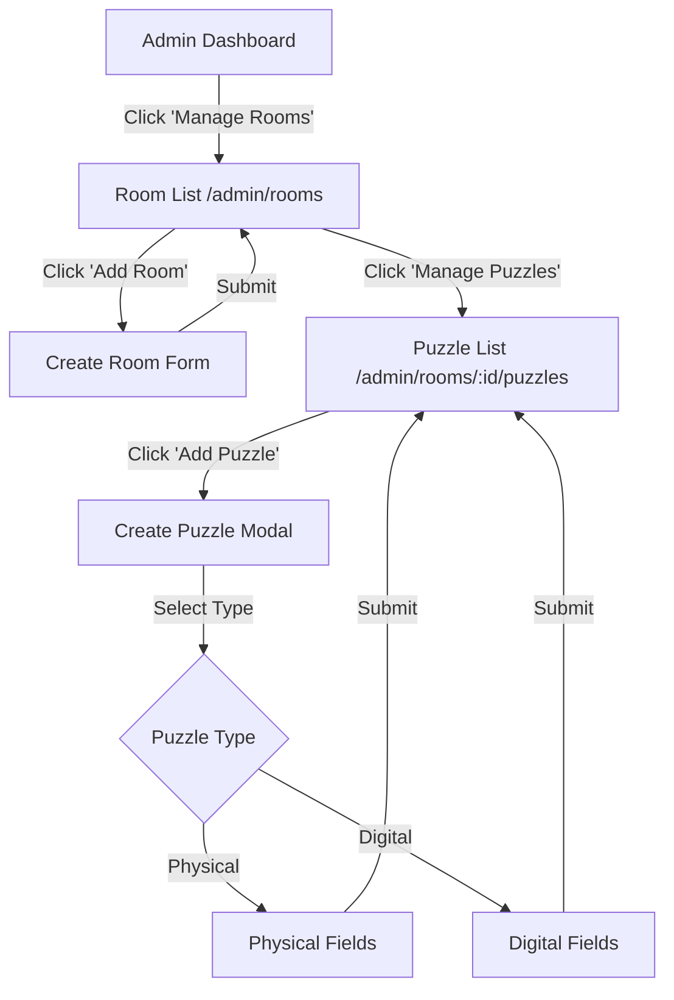

# Room & Puzzle Management Flow

This document outlines the proposed UI/UX flow for the Admin Room and Puzzle Management interface.

## 1. Room Management Dashboard

**Route**: `/admin/rooms`

### UI Layout
- **Header**: "Room Management"
- **Action Bar**:
    - `[+ Add New Room]` Button
    - Search/Filter bar (by difficulty, name)
- **Room List (Grid or Table)**:
    - Cards displaying:
        - Room Name
        - Difficulty (Stars/Number)
        - Max Players
        - Duration
        - **Actions**: `[Edit]`, `[Delete]`, `[Manage Puzzles]`

### Interactions
1.  **Add Room**: Opens a modal or redirects to `/admin/rooms/new`.
    -   Fields: Name, Description, Difficulty (1-10), Max Players, Duration (min), Price.
2.  **Edit Room**: Opens modal with pre-filled data.
3.  **Delete Room**: Shows confirmation alert ("Are you sure? This will delete all associated puzzles and bookings.").
4.  **Manage Puzzles**: Redirects to `/admin/rooms/[id]/puzzles`.

---

## 2. Puzzle Management Interface

**Route**: `/admin/rooms/[id]/puzzles`

### UI Layout
- **Header**: "Puzzles for [Room Name]"
- **Breadcrumb**: `Admin > Rooms > [Room Name] > Puzzles`
- **Action Bar**:
    - `[+ Add Puzzle]` Button
- **Puzzle List (Vertical List)**:
    - Items displaying:
        - Puzzle Name
        - Type (Physical/Digital)
        - Description (Truncated)
        - **Actions**: `[Edit]`, `[Delete]`

### Interactions
1.  **Add Puzzle**: Opens a modal.
    -   **Step 1**: Basic Info (Name, Description).
    -   **Step 2**: Select Type (Physical vs Digital).
    -   **Step 3 (Conditional)**:
        -   *If Physical*: Input `Reset Instructions`, `Prop ID`.
        -   *If Digital*: Input `Software Endpoint`, `Correct Answer Hash`.
2.  **Edit Puzzle**: Opens modal with pre-filled data.
3.  **Delete Puzzle**: Confirmation alert.

---

## 3. Data Flow Diagram

