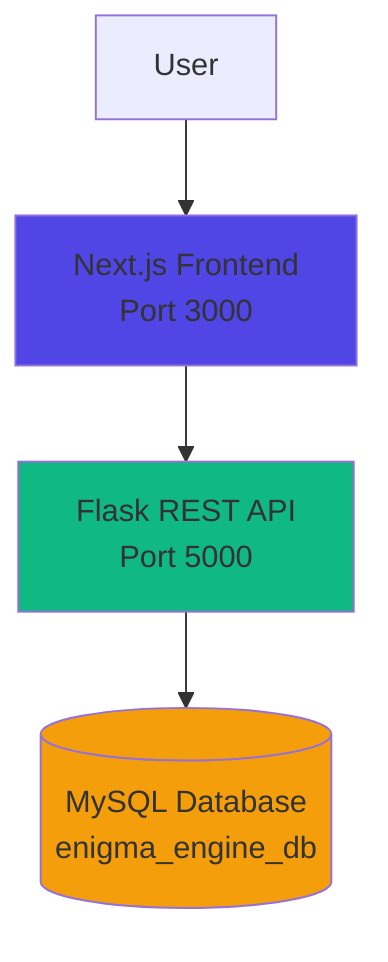
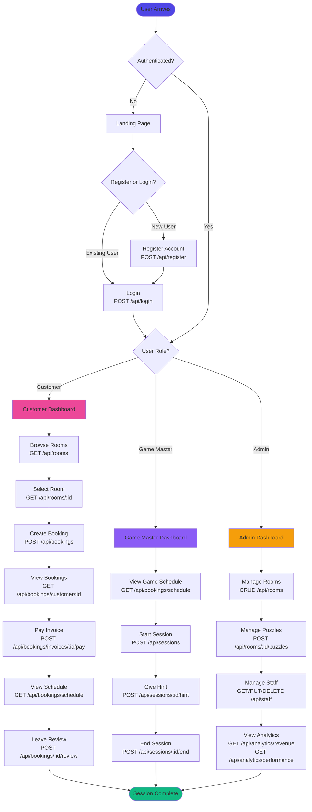
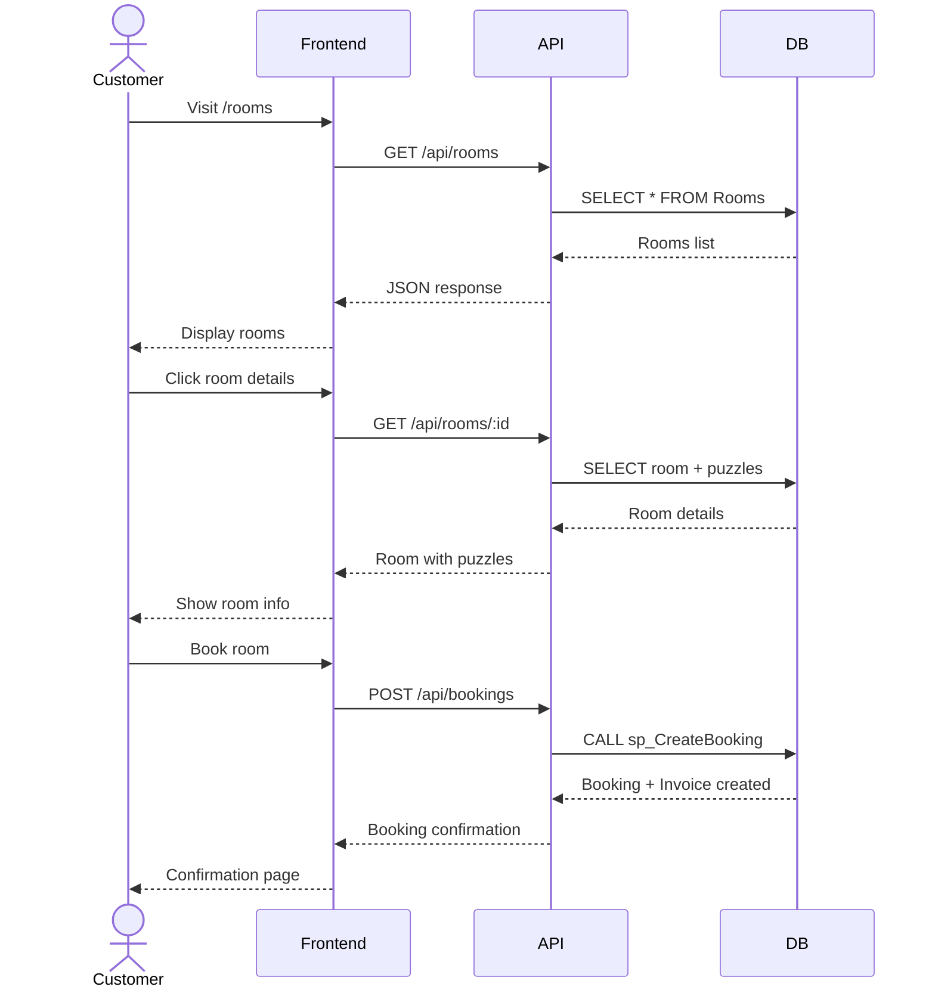
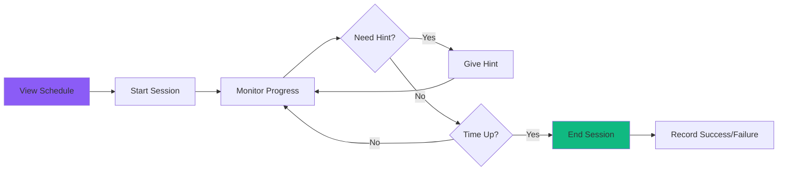
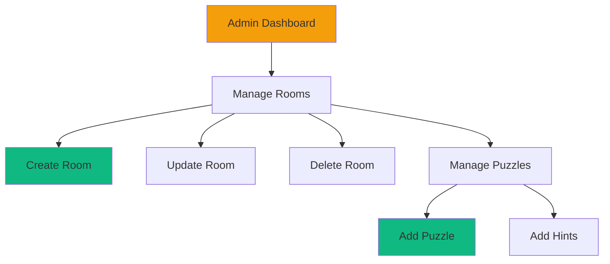
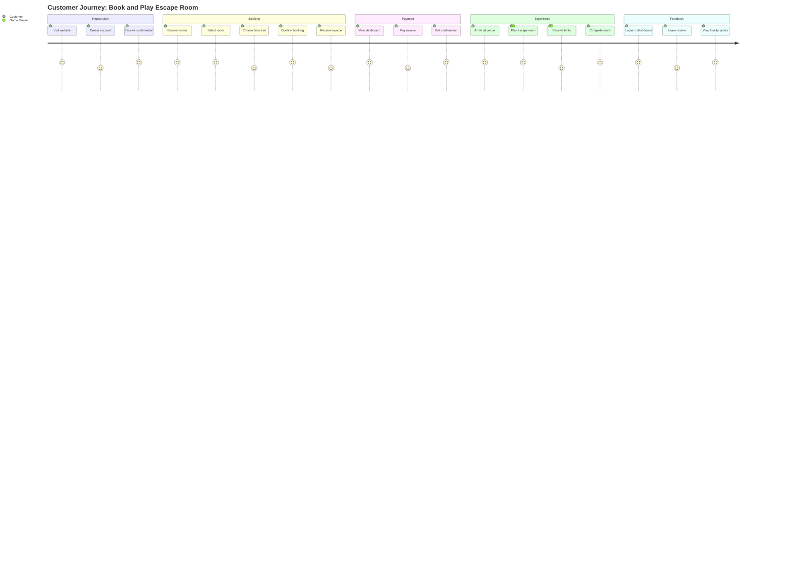
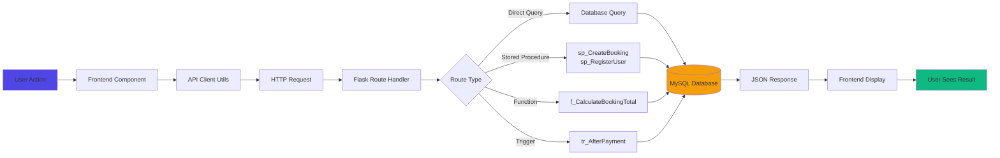

# User Flow - The Enigma Engine

## Overview
This document describes the complete user flow of The Enigma Engine application, detailing how different user types interact with the system through both the web interface and API endpoints.

---

## System Architecture



---

## User Roles

The system supports three distinct user roles:

1. **Customer** - Books and participates in escape room experiences
2. **Game Master** - Manages game sessions and provides hints
3. **Admin** - Oversees operations, manages staff, and views analytics

---

## Complete User Flow Diagram



---

## Detailed User Interactions by Role

### 1. Customer User Flow

#### 1.1 Registration & Authentication

**Register a New Account**
```http
POST /api/register
Content-Type: application/json

{
  "email": "customer@example.com",
  "password": "securePassword123",
  "firstName": "John",
  "lastName": "Doe",
  "phone": "555-1234",
  "role": "Customer"
}
```

**Login**
```http
POST /api/login
Content-Type: application/json

{
  "email": "customer@example.com",
  "password": "securePassword123"
}
```

**Response:**
```json
{
  "message": "Login successful",
  "user": {
    "id": 5,
    "firstName": "John",
    "lastName": "Doe",
    "role": "Customer"
  }
}
```

#### 1.2 Browse and Book Rooms



**Browse All Rooms**
```http
GET /api/rooms
```

**View Room Details**
```http
GET /api/rooms/1
```

**Create Booking**
```http
POST /api/bookings
Content-Type: application/json

{
  "customerId": 5,
  "roomId": 1,
  "scheduledTime": "2025-12-10T18:00:00",
  "numPlayers": 4
}
```

**Response:**
```json
{
  "message": "Booking confirmed",
  "bookingId": 10,
  "invoiceId": 15
}
```

#### 1.3 Manage Bookings and Payments

**View My Bookings**
```http
GET /api/bookings/customer/5
```

**View Booking Schedule**
```http
GET /api/bookings/schedule
```

**Pay Invoice**
```http
POST /api/bookings/invoices/15/pay
Content-Type: application/json

{
  "amount": 120.00,
  "paymentMethod": "Credit Card"
}
```

**Response:**
```json
{
  "message": "Payment successful"
}
```

---

### 2. Game Master User Flow

#### 2.1 Session Management



**View Scheduled Games**
```http
GET /api/bookings/schedule
```

**Start Game Session**
```http
POST /api/sessions
Content-Type: application/json

{
  "bookingId": 10,
  "gameMasterId": 3
}
```

**Response:**
```json
{
  "message": "Session started",
  "sessionId": 8
}
```

**Give Hint to Players**
```http
POST /api/sessions/8/hint
Content-Type: application/json

{
  "puzzleId": 5,
  "hintSequence": 2
}
```

**End Session**
```http
POST /api/sessions/8/end
Content-Type: application/json

{
  "success": true
}
```

---

### 3. Admin User Flow

#### 3.1 Room and Puzzle Management



**Create Room**
```http
POST /api/rooms
Content-Type: application/json

{
  "name": "The Haunted Mansion",
  "description": "Explore spooky corridors...",
  "difficultyLevel": 7,
  "maxPlayers": 6,
  "durationMinutes": 60
}
```

**Update Room**
```http
PUT /api/rooms/1
Content-Type: application/json

{
  "name": "The Haunted Mansion",
  "description": "Updated description...",
  "difficultyLevel": 8,
  "maxPlayers": 6,
  "durationMinutes": 60
}
```

**Delete Room**
```http
DELETE /api/rooms/1
```

**Add Puzzle to Room**
```http
POST /api/rooms/1/puzzles
Content-Type: application/json

{
  "name": "Ghostly Piano",
  "description": "Play the correct melody...",
  "puzzleType": "Physical",
  "resetInstructions": "Reset the keys to default position"
}
```

#### 3.2 Staff Management

**View All Staff**
```http
GET /api/staff
```

**Update Staff Member**
```http
PUT /api/staff/3
Content-Type: application/json

{
  "role": "GameMaster",
  "payRate": 25.00
}
```

**Delete Staff Member**
```http
DELETE /api/staff/3
```

#### 3.3 Analytics and Reports

**View Revenue Report**
```http
GET /api/analytics/revenue
```

**Response:**
```json
[
  {
    "roomName": "The Haunted Mansion",
    "month": "2025-12",
    "totalRevenue": 1250.00
  },
  {
    "roomName": "Cyberpunk Heist",
    "month": "2025-12",
    "totalRevenue": 980.00
  }
]
```

**View Performance Statistics**
```http
GET /api/analytics/performance
```

**Response:**
```json
[
  {
    "numPlayers": 4,
    "totalSessions": 25,
    "successfulSessions": 18,
    "successRate": 72.00
  }
]
```

---

## Common User Interactions

### Health Check
```http
GET /api/health
```

**Response:**
```json
{
  "status": "healthy",
  "database": "connected"
}
```

---

## API Endpoint Summary

### Authentication Endpoints
| Method | Endpoint | Description | User Role |
|--------|----------|-------------|-----------|
| POST | `/api/register` | Register new user | Public |
| POST | `/api/login` | Authenticate user | Public |

### Room Endpoints
| Method | Endpoint | Description | User Role |
|--------|----------|-------------|-----------|
| GET | `/api/rooms` | List all rooms | All |
| GET | `/api/rooms/:id` | Get room details | All |
| POST | `/api/rooms` | Create new room | Admin |
| PUT | `/api/rooms/:id` | Update room | Admin |
| DELETE | `/api/rooms/:id` | Delete room | Admin |
| POST | `/api/rooms/:id/puzzles` | Add puzzle to room | Admin |

### Booking Endpoints
| Method | Endpoint | Description | User Role |
|--------|----------|-------------|-----------|
| POST | `/api/bookings` | Create booking | Customer |
| GET | `/api/bookings/customer/:id` | View customer bookings | Customer |
| GET | `/api/bookings/schedule` | View booking schedule | Staff |
| POST | `/api/bookings/invoices/:id/pay` | Pay invoice | Customer |

### Session Endpoints
| Method | Endpoint | Description | User Role |
|--------|----------|-------------|-----------|
| POST | `/api/sessions` | Start game session | Game Master |
| POST | `/api/sessions/:id/hint` | Give hint | Game Master |
| POST | `/api/sessions/:id/end` | End session | Game Master |

### Staff Endpoints
| Method | Endpoint | Description | User Role |
|--------|----------|-------------|-----------|
| GET | `/api/staff` | List all staff | Admin |
| PUT | `/api/staff/:id` | Update staff member | Admin |
| DELETE | `/api/staff/:id` | Delete staff member | Admin |

### Analytics Endpoints
| Method | Endpoint | Description | User Role |
|--------|----------|-------------|-----------|
| GET | `/api/analytics/revenue` | Revenue report | Admin |
| GET | `/api/analytics/performance` | Performance stats | Admin |

---

## Frontend Pages and Navigation

### Public Pages
- **`/`** - Landing page with app introduction
- **`/register`** - New user registration form
- **`/login`** - User authentication form

### Customer Pages
- **`/rooms`** - Browse all available escape rooms
- **`/rooms/[id]`** - Room details and booking form
- **`/dashboard`** - View bookings and manage payments

### Staff Pages (Game Master)
- **`/gamemaster`** - View scheduled sessions
- **`/gamemaster/session/[id]`** - Manage active session

### Admin Pages
- **`/admin`** - Admin dashboard overview
- **`/admin/rooms`** - Manage rooms and puzzles
- **`/admin/staff`** - Manage staff members
- **`/admin/analytics`** - View reports and statistics

---

## User Journey Examples

### Example 1: Customer Books and Completes a Room



### Example 2: Game Master Runs a Session

1. **Login** to Game Master account
2. **View Schedule** (`GET /api/bookings/schedule`)
3. **Start Session** when customers arrive (`POST /api/sessions`)
4. **Monitor Progress** and provide hints when needed (`POST /api/sessions/:id/hint`)
5. **End Session** when time is up (`POST /api/sessions/:id/end`)
6. **Record Result** (success or failure)

### Example 3: Admin Reviews Performance

1. **Login** to Admin account
2. **View Dashboard** (`/admin`)
3. **Check Revenue** (`GET /api/analytics/revenue`)
4. **Review Performance Stats** (`GET /api/analytics/performance`)
5. **Manage Staff** if needed (`GET/PUT/DELETE /api/staff`)
6. **Update Room Details** based on feedback (`PUT /api/rooms/:id`)

---

## Data Flow Through the System



---

## Key Features and Commands

### 1. Authentication System
- User registration with role assignment
- Secure password hashing (Werkzeug)
- Session management
- Role-based access control

### 2. Booking System
- Check room availability
- Create bookings with automatic invoice generation
- Calculate total cost based on room price and players
- Prevent double-booking of time slots

### 3. Payment Processing
- Multiple payment methods (Credit Card, PayPal)
- Automatic invoice status updates
- Loyalty points reward system (10 points per payment)
- Payment triggers update customer loyalty

### 4. Game Session Management
- Track session start/end times
- Record success/failure outcomes
- Log hints given during gameplay
- Link sessions to Game Masters

### 5. Analytics and Reporting
- Revenue reports grouped by room and month
- Success rate analysis by team size
- Performance tracking across all sessions

---

## Technology Stack

### Backend
- **Framework**: Flask (Python)
- **Database**: MySQL with PyMySQL
- **Security**: Werkzeug password hashing
- **CORS**: Flask-CORS for cross-origin requests

### Frontend
- **Framework**: Next.js 14 (App Router)
- **Language**: TypeScript
- **Styling**: Tailwind CSS
- **HTTP Client**: Fetch API

### Database Features
- **Stored Procedures**: `sp_RegisterUser`, `sp_CreateBooking`
- **Functions**: `f_CalculateBookingTotal`
- **Triggers**: `tr_AfterPayment`
- **Views**: `v_CustomerBookings`

---

## Conclusion

The Enigma Engine provides a comprehensive escape room management system with distinct user flows for customers, game masters, and administrators. Users interact with the system through:

1. **Web Interface** - Next.js frontend for intuitive navigation
2. **REST API** - Flask backend with organized route blueprints
3. **Database** - MySQL with stored procedures and triggers for business logic

Each user role has specific commands and methods to perform their tasks efficiently, from booking rooms to managing sessions and analyzing business performance.
